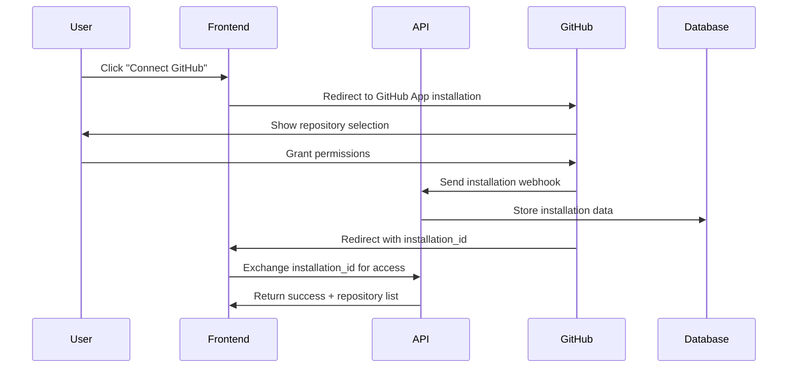

# GitHub Integration Contracts

## Overview
This document defines the GitHub App integration contracts for COGENT, covering authentication, permissions, file operations, and webhook handling.

## GitHub App Configuration

### App Settings
- **App Name**: COGENT Documentation Tool
- **Description**: Automated documentation generation and maintenance for codebases
- **Homepage URL**: https://usecogent.io
- **Callback URL**: https://cogent.vercel.app/auth/github/callback
- **Webhook URL**: https://cogent.vercel.app/api/webhooks/github
- **Webhook Secret**: Stored in environment variables

### Required Permissions
```yaml
Repository Permissions:
  - contents: read/write  # Read source files, write documentation
  - metadata: read        # Repository information
  - pull_requests: write  # Create PRs for documentation updates
  - issues: write         # Create issues for documentation tasks

Account Permissions:
  - email: read          # User email for account linking
```

### Installation Events
```yaml
Webhook Events:
  - installation         # App installed/uninstalled
  - installation_repositories  # Repository access granted/revoked
  - push                 # Code changes (for future auto-documentation)
  - pull_request         # PR events (for future review integration)
```

## API Integration Contracts

### 1. Repository Access

#### List User Repositories
```typescript
GET /api/v1/github/repos
Headers: Authorization: Bearer {clerk_session_token}

Response: GitHubReposResponse
{
  "repositories": [
    {
      "id": 123456,
      "name": "my-project",
      "full_name": "username/my-project", 
      "private": false,
      "html_url": "https://github.com/username/my-project",
      "description": "My awesome project",
      "default_branch": "main",
      "permissions": {
        "admin": false,
        "push": true,
        "pull": true
      }
    }
  ]
}
```

#### Validate Repository Access
```typescript
GET /api/v1/github/repos/{owner}/{repo}/access
Headers: Authorization: Bearer {clerk_session_token}

Response: 
{
  "has_access": true,
  "permission_level": "write",
  "installation_id": 12345678
}
```

### 2. File Operations

#### List Repository Files
```typescript  
GET /api/v1/github/repos/{owner}/{repo}/files?path={path}&ref={branch}
Headers: Authorization: Bearer {clerk_session_token}

Response: GitHubFilesResponse
{
  "files": [
    {
      "name": "README.md",
      "path": "README.md",
      "sha": "abc123def456",
      "size": 1024,
      "type": "file",
      "content": null,  # Not included in directory listing
      "encoding": null
    },
    {
      "name": "src",
      "path": "src", 
      "sha": null,
      "size": 0,
      "type": "dir",
      "content": null,
      "encoding": null
    }
  ]
}
```

#### Get File Content
```typescript
GET /api/v1/github/repos/{owner}/{repo}/files/{path}?ref={branch}
Headers: Authorization: Bearer {clerk_session_token}

Response: GitHubFile
{
  "name": "auth.js",
  "path": "src/auth.js", 
  "sha": "def456abc789",
  "size": 2048,
  "type": "file",
  "content": "Ly8gQXV0aGVudGljYXRpb24gdXRpbGl0aWVz...", # Base64 encoded
  "encoding": "base64"
}
```

#### Create/Update File
```typescript
PUT /api/v1/github/repos/{owner}/{repo}/files
Headers: Authorization: Bearer {clerk_session_token}
Content-Type: application/json

Request: GitHubFileUpdate
{
  "path": ".cogent/docs/src/auth.md",
  "content": "# Authentication Module\n\nThis module handles...", # Raw content, will be base64 encoded
  "message": "📝 Update documentation for auth module",
  "branch": "main",
  "sha": "existing_sha_if_updating" # Optional, required for updates
}

Response: GitHubFile
{
  "name": "auth.md",
  "path": ".cogent/docs/src/auth.md",
  "sha": "new_sha_123abc",
  "size": 1536,
  "type": "file",
  "content": null,
  "encoding": null
}
```

### 3. Branch Operations

#### List Branches
```typescript
GET /api/v1/github/repos/{owner}/{repo}/branches
Headers: Authorization: Bearer {clerk_session_token}

Response:
{
  "branches": [
    {
      "name": "main",
      "commit": {
        "sha": "abc123def456",
        "url": "https://api.github.com/repos/owner/repo/commits/abc123def456"
      },
      "protected": true
    }
  ]
}
```

#### Get Latest Commit
```typescript  
GET /api/v1/github/repos/{owner}/{repo}/commits/latest?ref={branch}
Headers: Authorization: Bearer {clerk_session_token}

Response:
{
  "sha": "abc123def456",
  "commit": {
    "message": "Add new feature",
    "author": {
      "name": "Developer Name",
      "email": "dev@example.com",
      "date": "2024-01-15T10:30:00Z"
    }
  },
  "html_url": "https://github.com/owner/repo/commit/abc123def456"
}
```

## Authentication Flow

### 1. GitHub App Installation


### 2. Installation Webhook Handler
```python
@router.post("/api/webhooks/github")
async def github_webhook(
    request: Request,
    x_hub_signature_256: str = Header(None)
):
    """Handle GitHub App installation webhooks"""
    
    # Verify webhook signature
    payload = await request.body()
    if not verify_github_webhook(payload, x_hub_signature_256):
        raise HTTPException(status_code=401, detail="Invalid webhook signature")
    
    data = await request.json()
    event_type = request.headers.get("X-GitHub-Event")
    
    if event_type == "installation":
        await handle_installation_event(data)
    elif event_type == "installation_repositories":
        await handle_installation_repositories_event(data)
    
    return {"status": "received"}

async def handle_installation_event(data: dict):
    """Process GitHub App installation/uninstallation"""
    action = data["action"]  # "created", "deleted", "suspend", "unsuspend"
    installation = data["installation"]
    
    if action == "created":
        # Store installation data
        installation_data = {
            "installation_id": installation["id"],
            "account_login": installation["account"]["login"],
            "account_type": installation["account"]["type"],
            "permissions": installation["permissions"],
            "repository_selection": installation["repository_selection"]
        }
        # Save to database associated with user session
```

### 3. JWT Token Generation for API Access
```python
import jwt
import requests
from datetime import datetime, timedelta

class GitHubAppAuth:
    def __init__(self, app_id: str, private_key: str):
        self.app_id = app_id
        self.private_key = private_key
    
    def generate_jwt(self) -> str:
        """Generate GitHub App JWT for authentication"""
        now = datetime.utcnow()
        payload = {
            "iat": int(now.timestamp()),
            "exp": int((now + timedelta(minutes=10)).timestamp()),
            "iss": self.app_id
        }
        return jwt.encode(payload, self.private_key, algorithm="RS256")
    
    async def get_installation_token(self, installation_id: int) -> str:
        """Get installation access token for API calls"""
        jwt_token = self.generate_jwt()
        
        headers = {
            "Authorization": f"Bearer {jwt_token}",
            "Accept": "application/vnd.github.v3+json",
            "X-GitHub-Api-Version": "2022-11-28"
        }
        
        url = f"https://api.github.com/app/installations/{installation_id}/access_tokens"
        response = requests.post(url, headers=headers)
        
        if response.status_code == 201:
            return response.json()["token"]
        else:
            raise Exception(f"Failed to get installation token: {response.text}")
```

## Error Handling

### API Error Responses
```typescript
// Repository not found or no access
Status: 404
{
  "error": "repository_not_found",
  "message": "Repository not found or access denied",
  "details": {
    "repository": "owner/repo",
    "required_permission": "contents:read"
  }
}

// File operation failed
Status: 409
{
  "error": "file_conflict",
  "message": "File has been modified since last read",
  "details": {
    "path": "src/auth.js",
    "expected_sha": "abc123",
    "actual_sha": "def456"
  }
}

// Rate limit exceeded
Status: 429
{
  "error": "rate_limit_exceeded", 
  "message": "GitHub API rate limit exceeded",
  "details": {
    "limit": 5000,
    "remaining": 0,
    "reset_time": "2024-01-15T11:00:00Z"
  }
}
```

### Retry Logic
```python
import asyncio
from typing import Optional

class GitHubApiClient:
    async def make_request_with_retry(
        self, 
        method: str, 
        url: str, 
        max_retries: int = 3,
        backoff_factor: float = 1.0
    ) -> Optional[dict]:
        """Make GitHub API request with exponential backoff retry"""
        
        for attempt in range(max_retries):
            try:
                response = await self._make_request(method, url)
                
                if response.status_code == 200:
                    return response.json()
                elif response.status_code == 429:  # Rate limited
                    retry_after = int(response.headers.get("Retry-After", 60))
                    await asyncio.sleep(retry_after)
                elif response.status_code in [502, 503, 504]:  # Server errors
                    wait_time = backoff_factor * (2 ** attempt)
                    await asyncio.sleep(wait_time)
                else:
                    # Client error, don't retry
                    break
                    
            except Exception as e:
                if attempt == max_retries - 1:
                    raise e
                
                wait_time = backoff_factor * (2 ** attempt) 
                await asyncio.sleep(wait_time)
        
        return None
```

## Documentation File Management

### File Path Resolution
```python
class DocumentationPathResolver:
    """Resolve documentation file paths based on project settings"""
    
    def __init__(self, project_settings: dict):
        self.doc_location = project_settings.get("doc_location", ".cogent/docs")
        self.alongside_source = project_settings.get("alongside_source", False)
    
    def get_doc_path(self, source_file_path: str) -> str:
        """Get documentation file path for a source file"""
        
        if self.alongside_source:
            # Store next to source file: src/auth.js -> src/auth.md
            base_path = source_file_path.rsplit('.', 1)[0]
            return f"{base_path}.md"
        else:
            # Store in doc directory: src/auth.js -> .cogent/docs/src/auth.md  
            doc_path = source_file_path.rsplit('.', 1)[0] + '.md'
            return f"{self.doc_location}/{doc_path}"
    
    def get_source_files(self, repo_files: List[str], include_patterns: List[str], exclude_patterns: List[str]) -> List[str]:
        """Filter repository files based on include/exclude patterns"""
        import fnmatch
        
        included_files = []
        
        for file_path in repo_files:
            # Check include patterns
            included = any(fnmatch.fnmatch(file_path, pattern) for pattern in include_patterns)
            if not included:
                continue
                
            # Check exclude patterns  
            excluded = any(fnmatch.fnmatch(file_path, pattern) for pattern in exclude_patterns)
            if excluded:
                continue
                
            included_files.append(file_path)
        
        return included_files
```

### Commit Message Templates
```python
COMMIT_MESSAGE_TEMPLATES = {
    "create": "📝 Add documentation for {file_path}",
    "update": "📝 Update documentation for {file_path}", 
    "delete": "📝 Remove documentation for {file_path}",
    "bulk_update": "📝 Update documentation for {count} files",
    "initial": "📝 Initialize COGENT documentation system"
}

def generate_commit_message(operation: str, file_path: str = None, count: int = None) -> str:
    """Generate appropriate commit message for documentation changes"""
    template = COMMIT_MESSAGE_TEMPLATES.get(operation, "📝 Update documentation")
    
    if file_path:
        return template.format(file_path=file_path)
    elif count:
        return template.format(count=count)
    else:
        return template
```

This completes the GitHub integration contracts, providing a comprehensive foundation for Sprint 0 implementation.